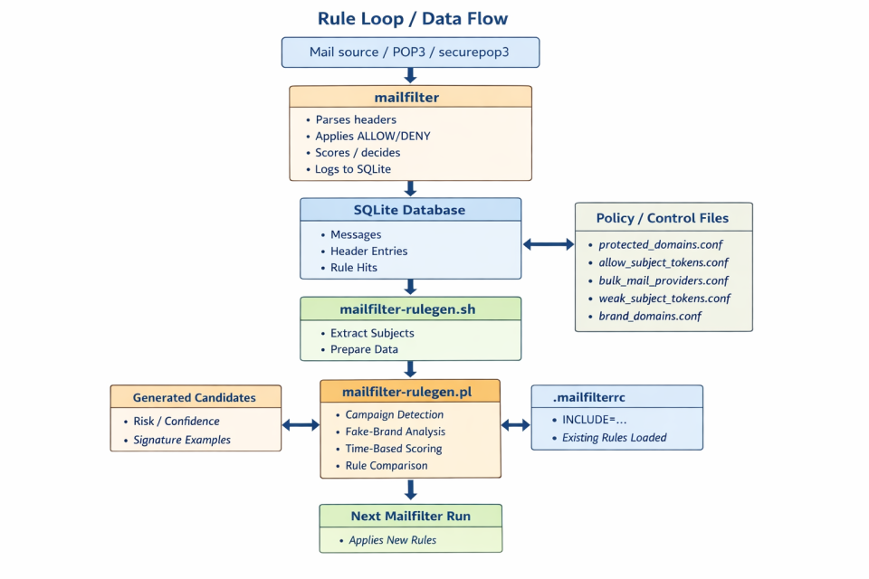

<!-- Logo + Titel -->

<p align="center">
  
</p>

<h1 align="center">mailfilter-sqlite</h1>

<p align="center">
  <b>Deterministic mail pre-filter with SQLite-based header analysis and offline rule generation</b>
</p>

<p align="center">
  <i>Explainable. Predictable. No black box.</i>
</p>

<p align="center">
  <b>Abstract: </b>The system extends the classic <b>mailfilter</b> with an SQLite-based evaluation layer. This transforms mailfilter not only into a filter, but also into a header crawler, an analysis tool, and a generator for dynamic additional rules. The separation between the live database, test databases, and rule files included via includes makes the concept manageable and scalable.
</p>

<br>

---

##  Core Idea

Collect real-world mail header data -> analyze it -> generate better rules.

**mailfilter-sqlite turns experience into rules.**
Based on the original **mailfilter** https://mailfilter.sourceforge.io/ (C) by Andreas Bauer.

---

##  What makes this different

mailfilter-sqlite is no longer just a mail filter.

It is:

* a header crawler
* a structured data collector
* a campaign analysis engine
* a deterministic rule generator

 It transforms mail filtering from reactive filtering into **proactive rule engineering**

---

##  Example: Generated Analysis Candidate


The system automatically detects:

* phishing campaigns
* fake brand domains (e.g. `amaz0n`, `paypa1`)
* recurring infrastructure patterns
* risk levels and confidence

…and generates **ready-to-use rule suggestions**

## 📂 Real Output Examples

See real generated rule candidates:

👉 [output-examples](output-examples/)

These examples demonstrate real-world campaign detection and rule suggestions.

---

##  Offline Rule Engineering

Rules are **NOT modified automatically at runtime**.

Instead:

1. headers are collected
2. patterns are analyzed
3. rules are suggested
4. rules are reviewed and deployed

 ensures:

* stability
* transparency
* auditability
* zero unexpected behavior

---

##  SQLite as Intelligence Layer

The SQLite database is the core of the system.

It stores:

* parsed header structures
* rule hit history
* scoring decisions
* campaign patterns

 enables:

* reproducible analysis
* statistical evaluation
* long-term pattern detection

---

##  Campaign Detection

Messages are grouped into campaign signatures based on:

* sender domains
* infrastructure (Received hosts)
* subject patterns

 Detects **spam waves instead of single emails**

---

##  False Positive Protection

The system is conservative by design:

* protected domains are never blindly blocked
* bulk providers are handled carefully
* weak signals are filtered
* legitimate language patterns are recognized

 Focus: **precision over aggressiveness**

---

##  Key Features

* Header-only analysis (no body required)
* SQLite-based structured logging
* Deterministic rule generation
* Campaign clustering
* Fake-brand detection (typosquatting)
* Rule suggestion system (DENY / SCORE)
* Externalized policy configuration
* Fully explainable decisions

---

##  Architecture

```
mailfilter -> SQLite -> rulegen -> rules -> mailfilter
```

### Pipeline

1. **Collection**

   * mailfilter reads headers
   * logs into SQLite

2. **Analysis**

   * rulegen evaluates patterns and campaigns

3. **Deployment**

   * rules are exported and included

---

## Rule Loop / Data Flow

mailfilter-sqlite extends the classic mailfilter workflow into a controlled, database-driven rule engineering loop.

Unlike traditional spam filters, this system separates **data collection**, **analysis**, and **rule application** into distinct stages.

<p align="center">
  <a href="docs/images/architecture/rule-loop.png">
    
  </a>
</p>

```text
Mail source / POP3 / securepop3
          |
          v
+----------------------+
|      mailfilter      |
|----------------------|
| parses headers       |
| applies ALLOW/DENY   |
| scores / decides     |
| logs to SQLite       |
+----------------------+
          |
          v
+----------------------+
|   SQLite database    |
|----------------------|
| messages             |
| header_entries       |
| rule_hits            |
+----------------------+
          |
          v
+----------------------+
| mailfilter-rulegen.sh|
|----------------------|
| extract subjects     |
| extract headers      |
| prepare input data   |
+----------------------+
          |
          v
+----------------------+
| mailfilter-rulegen.pl|
|----------------------|
| campaign detection   |
| fake-brand analysis  |
| time-based scoring   |
| rule comparison      |
| false-positive guard |
+----------------------+
          |
          | uses
          v
+----------------------------------+
| policy / control files           |
|----------------------------------|
| protected_domains.conf           |
| allow_subject_tokens.conf        |
| bulk_mail_providers.conf         |
| weak_subject_tokens.conf         |
| brand_domains.conf               |
+----------------------------------+
          |
          +-----------------------------+
          |                             |
          v                             v
+----------------------+    +-------------------------------+
| generated-candidates |    | exported rule files           |
|----------------------|    |-------------------------------|
| risk / confidence    |    | generated-rules.conf          |
| reasons / examples   |    | generated-conservative-...    |
| campaign signatures  |    | generated-aggressive-...      |
+----------------------+    +-------------------------------+
                                             |
                                             v
                                  +--------------------------+
                                  |       .mailfilterrc      |
                                  |--------------------------|
                                  | INCLUDE="..."            |
                                  | existing rules loaded    |
                                  +--------------------------+
                                             |
                                             v
                                  +--------------------------+
                                  | next mailfilter run      |
                                  | applies new rules        |
                                  +--------------------------+
```

This architecture forms a controlled feedback loop:

mailfilter → SQLite logging → analysis → rule generation → controlled inclusion → next filtering cycle

---

### Controlled Rule Generation

The rule generator does not operate in isolation.

It evaluates structured header data stored in SQLite against:

- existing rules from `.mailfilterrc`
- policy/control files (e.g. `protected_domains.conf`)
- statistical and structural patterns observed in real traffic

Instead of modifying rules automatically at runtime, it produces:

- `generated-candidates.conf` (annotated analysis output)
- optional exported rule files for controlled inclusion

This creates a **transparent and auditable rule loop**.

---

### The Role of `.mailfilterrc`

The `.mailfilterrc` file is part of the feedback loop:

- Existing ALLOW/DENY rules are parsed and respected during analysis
- Newly generated rules are reintroduced via `INCLUDE="..."`

This ensures:

- no blind overwriting of existing logic
- consistent behavior across iterations
- safe incremental rule evolution

---

### Why `generated-candidates.conf` matters

The candidate file is not just an intermediate artifact.

It contains:

- risk scores and confidence levels
- explanation of why a candidate was generated
- detected patterns and campaign indicators
- suggested rule types (DENY / SCORE)

This allows manual validation before rules are activated.

---

### Policy / Control Files

Policy files actively influence rule generation:

- `protected_domains.conf` prevents false positives on trusted domains
- `allow_subject_tokens.conf` supports contextual ALLOW logic
- `bulk_mail_providers.conf` reduces overly aggressive infrastructure blocking
- `weak_subject_tokens.conf` filters low-value candidates
- `brand_domains.conf` improves fake-brand detection

These files are a key part of the system's precision.

---

##  Quick Start

```bash
mkdir -p /etc/mailfilter
mkdir -p /etc/mailfilter/rulegen
mkdir -p /var/spool/filter
```

Add to `.mailfilterrc`:

```conf
INCLUDE="/etc/mailfilter/generated-rules.conf"
```

Run:

```bash
./mailfilter-rulegen.sh \
  --db /var/spool/filter/mailheader.sqlite3 \
  --mailfilterrc /etc/mailfilter/.mailfilterrc \
  --out generated-candidates.conf \
  --highscore 100 \
  --min-deny-hits 2 \
  --max-pass-hits 0 \
  --min-phrase-size 2 \
  --max-phrase-size 3 \
  --export-rules /etc/mailfilter/generated-rules.conf \
  --export-cons /etc/mailfilter/generated-conservative-rules.conf \
  --export-aggr /etc/mailfilter/generated-aggressive-rules.conf
```

---

##  Reproducible Testing

* import headers from `.eml` files
* use separate SQLite test databases
* compare outputs across datasets

 Safe rule development without affecting production

---

##  Versioning Concept

* mailfilter 0.8.x -> classic filtering
* mailfilter-sqlite 2.x -> data-driven generation

 This is a **new generation**, not just an extension

---

##  Documentation

* QUICKSTART.md
* INSTALL.md
* CONFIGURATION.md
* RULEGEN.md
* SQLITE_INTEGRATION.md
* USECASES.md

---

##  What this project is not

* not machine learning
* not a black box
* not self-modifying at runtime

 Everything is **controlled and explainable**

---

##  Attribution

**mailfilter-sqlite** Based on the original **mailfilter** https://mailfilter.sourceforge.io/ (C) by Andreas Bauer.

Extended with:

* SQLite logging
* rule generation system
* campaign analysis
* bug fixes and enhancements

---

##  License

GNU General Public License (GPL)

Original copyrights preserved.
