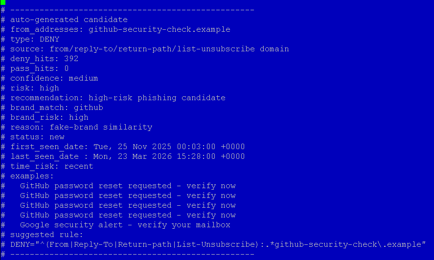

<p align="center">
  
</p>

<h1 align="center">mailfilter-sqlite</h1>

**A deterministic mail pre-filter with offline rule generation and SQLite-based header analysis.**



**mailfilter-sqlite** is an extended fork of the original **mailfilter** https://mailfilter.sourceforge.io/ (C) by Andreas Bauer.

The example above demonstrates:

- automatic phishing campaign detection  
- fake brand recognition (e.g. `github-security-check.example`)  
- risk classification and confidence scoring  
- automatic rule suggestion generation  

It preserves the original core filtering behavior and adds:

- structured SQLite header logging  
- campaign and phishing analysis  
- offline rule generation  
- deterministic and explainable decisions  
- reusable mail telemetry for further analysis tools  

---

## Why this project exists

Traditional mail filtering often happens too late in the pipeline.

mailfilter-sqlite shifts detection to the earliest possible stage:

- headers are analyzed before full message retrieval  
- spam campaigns are identified offline  
- rules are generated proactively  
- unwanted messages can be blocked before reaching downstream components such as MTA or SpamAssassin  

This reduces system load while preserving administrator control.

---

## Key Features

- **Header-first filtering**
  - no message body required  
  - fast and lightweight  

- **SQLite integration**
  - structured storage of:
    - messages  
    - header entries  
    - rule hits  
    - final decisions  

- **Offline rule generation**
  - no live self-modifying behavior  
  - rules are generated in controlled batches  

- **Campaign detection**
  - subject similarity  
  - sender domains  
  - received hosts  
  - repeated infrastructure patterns  

- **Fake-brand / typosquatting detection**
  - examples:
    - `arnazon`  
    - `amaz0n`  
    - `paypa1`  
    - `g00gle`  
    - `micr0soft`  

- **False-positive protection**
  - ALLOW proximity  
  - protected domains  
  - bulk provider awareness  
  - conservative export logic  

- **Deterministic behavior**
  - same input → same output  
  - no hidden heuristics  
  - no machine learning required  

---

## Architecture

The system is built in three stages:

1. **Collection**
   - mailfilter retrieves and parses headers  
   - headers are logged to SQLite  

2. **Analysis**
   - `rulegen` evaluates domains, subjects, campaigns and infrastructure  

3. **Rule deployment**
   - rules are exported into include files  
   - mailfilter applies them on later runs  

```
mailfilter → SQLite → rulegen → rules → mailfilter
```

---

## Quick Start

```bash
mkdir -p /etc/mailfilter
mkdir -p /etc/mailfilter/rulegen
mkdir -p /var/spool/filter
```

Prepare a SQLite database (choose one):

- copy a provided schema template  
- let mailfilter create it automatically  
- or build a test database using provided `.eml` datasets  

Copy scripts into `/etc/mailfilter/`, example policy files into `/etc/mailfilter/rulegen/`, and add this to your `mailfilterrc`:

```conf
INCLUDE="/etc/mailfilter/generated-rules.conf"
```

Then run:

```bash
cd /etc/mailfilter

./mailfilter-rulegen.sh \
  --db /var/spool/filter/mailheader.sqlite3 \
  --mailfilterrc /etc/mailfilter/.mailfilterrc \
  --out generated-candidates.conf \
  --highscore 100 \
  --min-deny-hits 2 \
  --max-pass-hits 0 \
  --min-phrase-size 2 \
  --max-phrase-size 3 \
  --export-rules /etc/mailfilter/generated-rules.conf \
  --export-cons /etc/mailfilter/generated-conservative-rules.conf \
  --export-aggr /etc/mailfilter/generated-aggressive-rules.conf
```

---

## Attribution

This project is based on the original **mailfilter** by Andreas Bauer.

mailfilter-sqlite extends it with:

- SQLite-based structured logging  
- rule generation tooling  
- additional fixes and enhancements  

---

## License

Distributed under the GNU General Public License (GPL), consistent with the original project.

Original copyright notices are preserved.
