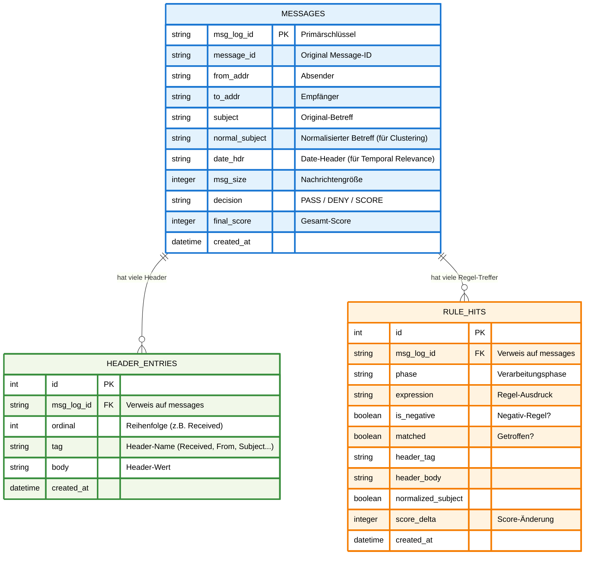

# SQLITE_INTEGRATION.md

## Überblick

Die SQLite-Integration erweitert das bestehende Logging-System von mailfilter
um eine strukturierte Datenbank zur Analyse und Regelgenerierung.

---

## Bestehendes Logging

Mailfilter kann Header optional in eine Textdatei schreiben:

    SHOW_HEADERS = "/var/spool/filter/mailheader.log"

Dieses Logging dient hauptsächlich der Analyse und Fehlersuche.

---

## SQLite-Logging

Das SQLite-Backend speichert die gleichen Informationen strukturiert:

    LOG_HEADERS_SQLITE3 = "/var/spool/filter/mailheader.log.sqlite3"

Beide Logging-Varianten können unabhängig voneinander aktiviert werden.

---

## Designansatz

- Das SQLite-Logging ist an denselben Stellen integriert, an denen Header
  verarbeitet und bewertet werden.

- Es wird keine separate Parsing-Logik verwendet.

- Das ursprüngliche Filterverhalten bleibt unverändert.

- Es wurden lediglich zusätzliche Logging-Hooks ergänzt.

---

## Implementierungsdetails

- Initialisierung erfolgt beim Programmstart (wenn aktiviert)
- Logging erfolgt während der Header-Verarbeitung und Regelbewertung
- Datenbank wird beim Programmende sauber geschlossen

Die Implementierung ist im Modul `dblog.cc` gekapselt.

---

## Gespeicherte Daten

Die Datenbank enthält strukturierte Informationen:

### messages
- Nachrichten-ID
- Entscheidung (pass / deny / score-deny)
- finaler Score

### header_entries
- einzelne Headerfelder (Name/Wert)
- Verknüpfung zur Nachricht

### rule_hits
- Bewertungsphase
- Ausdruck
- Trefferstatus
- Score-Beitrag

---

---

## Datenumfang

- Es werden ausschließlich Header gespeichert
- Kein Mail-Body wird erfasst
- Die Daten spiegeln den internen Entscheidungsprozess wider

---

## Vorteile

- Strukturierte und durchsuchbare Daten
- Direkte Nutzung für Regelgenerierung
- Keine Beeinflussung des bestehenden Verhaltens
- Vollständig deterministisch

---

## Zusammenfassung

Die SQLite-Integration ist eine nicht-invasive Erweiterung des bestehenden
Logging-Systems. Sie ermöglicht tiefe Einblicke in den Entscheidungsprozess,
ohne das Kernverhalten von mailfilter zu verändern.
